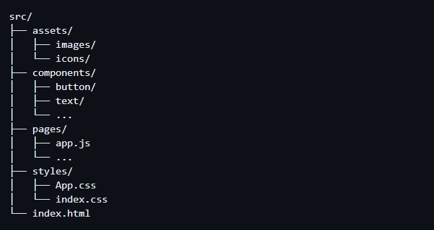

# Pixel-Perfect Implementation of TransitFlow WebPage

This repository contains my implementation of the Home Page design provided in Figma. I have followed all the style guides provided to ensure a pixel-perfect implementation.

## Code Structure

I have used React, CSS, and Tailwind CSS to implement the design. The code is structured as follows:

## Image

I have organized the code into the following subfolders:

- `assets`: Contains subfolders for images and icons that will be used in the project.
- `components`: Contains subfolders for different components that will be used throughout the project, such as buttons and text components.
- `pages`: Contains subfolders for each page in the project, and the `app.js` file is the entry point for the app. 
- `styles`: Contains subfolders for CSS files, including Tailwind CSS and custom styles.
- `index.html`: The main HTML file for the project which is in the public folder.

By structuring the code in this way, it will be easier to navigate and modify as the project grows.

I have organized the code into sections that correspond to the different sections of the page, making it easy to navigate and modify.

## View Website

You can view the website live at https://transitflow.netlify.app/.

## Difficulty Encountered

During the course of my development, I encountered some design-related difficulties, particularly with the use of absolute positioning. It had been a while since I had worked with complex designs, and I had to refresh my knowledge of absolute positioning.

Additionally, this was my first time using Tailwind CSS for styling complex design pages like this, and it was a whole new experience. However, I found that once I got used to the utility classes and the structure of the framework, it made it much easier and quicker to implement the design.

## Image

The above image is a screenshot of the TransitFlow Home Page implementation.